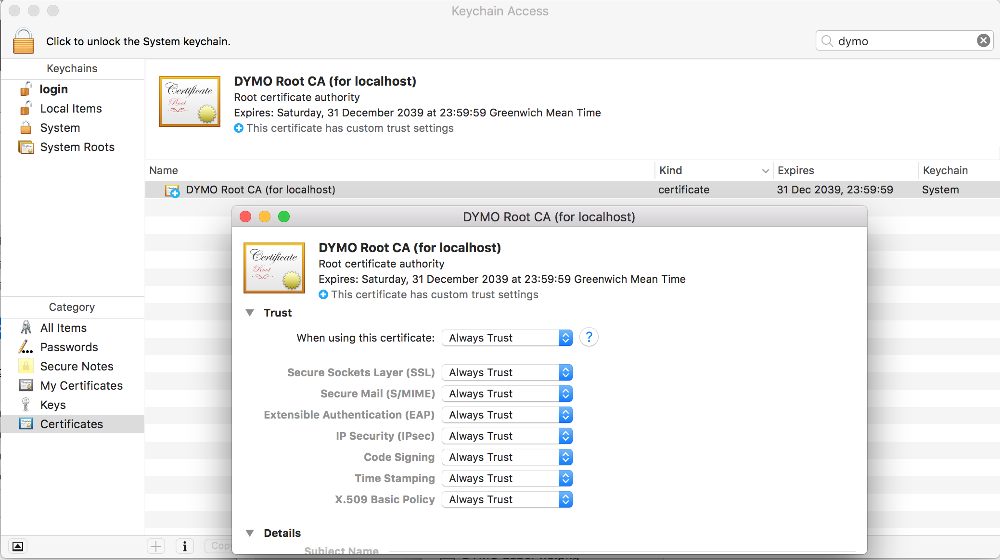
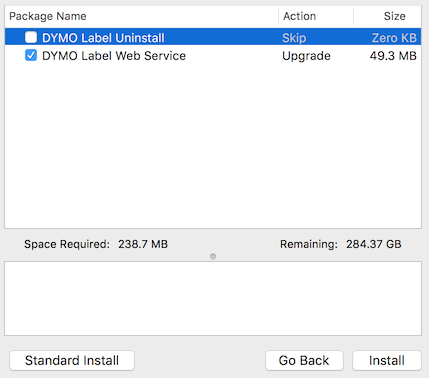
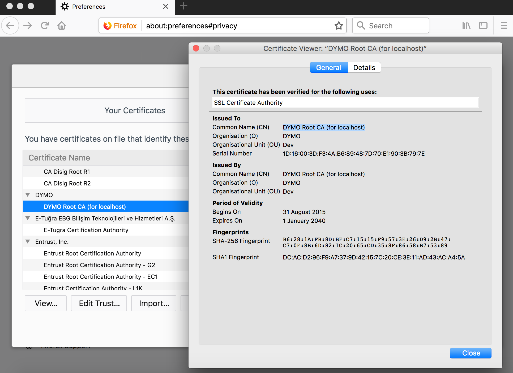

DYMO Root CA is a Security Risk
-------------------------------

While going through the list of Root Certificate Authorities on my computer,
I found one I wasn't expecting there, called "DYMO Root CA (for localhost)".
This certificate was installed by the label printing software, I installed for my
[DYMO Label Printer].



It is intended purpose is to allow web-based tools to send content to the label printer
to be printed on the local machine. It does it by allowing your web browser to access a 
web server running on your local computer. And because of [Mixed Content] rules, if the
webpage is served from an HTTPS page, then all the content and sub-requests must also 
be on HTTPS.

There have been cases of this before, for example [EA Origin and Blizzard battle.net],
where they have managed to get an official Certificate Authority to issue a certificate
for localhost and the when the certificate was revoked, resorted to creating their own CA,
which their installer installs on your systems keychain.

The problem with this is that DYMO is now trusted by your computer to issue certificates 
for anything - your bank, Facebook, Paypal, Operating System updates etc. If DYMO was to 
loose this private key, it could make you susceptible to man-in-the-middle attacks -
where the attacker intercepts your communications, while you think you are talking
directly to the real thing.


It looks like DYMO did this in response to browser vendors removing support for native plugins:

> In the past, developers had to provide a browser-specific
> plug-in for each major web browser.  Nowadays, most browsers
> have phased out native plug-in support.  Google, for
> example, stopped supporting Chrome their NPAPI browser
> extension in September 2015.  In response, we released the
> DYMO Web Service as a new cross-browser solution allowing
> third-party developer applications the ability to interface
> with the DLS SDK in a seamless, browser-agnostic fashion.

Links:
* http://developers.dymo.com/2016/08/08/dymo-label-web-service-faq/
* http://developers.dymo.com/2015/08/20/dymo-label-framework-javascript-library-2-0-open-beta/

From reading the comments on those blog posts it looks like the development team were
aware that what they were doing was a bad idea but went ahead with the approach anyway.




Note that it is possible to customise the install and not install *'DYMO Label Web Service'*,
however this option is enabled by default.


On mac OS the Web Server application is installed inside `/Library/Frameworks/DYMO/SDK/`.
Here is a Directory listing:

```
DYMO.DLS.Printing.Host.app/Contents/Info.plist
DYMO.DLS.Printing.Host.app/Contents/MacOS/DYMO.DLS.Printing.Host
DYMO.DLS.Printing.Host.app/Contents/MonoBundle/DYMO.DLS.Printing.Host.exe
DYMO.DLS.Printing.Host.app/Contents/MonoBundle/DYMO.DLS.Printing.Service.dll
DYMO.DLS.Printing.Host.app/Contents/MonoBundle/libWebAddin.dylib
DYMO.DLS.Printing.Host.app/Contents/MonoBundle/MonoMac.dll
DYMO.DLS.Printing.Host.app/Contents/Resources/ConfigurationWindow.nib
DYMO.DLS.Printing.Host.app/Contents/Resources/DLSMain.png
DYMO.DLS.Printing.Host.app/Contents/Resources/DLSMain@2x.png
DYMO.DLS.Printing.Host.app/Contents/Resources/DYMO_Label.icns
DYMO.DLS.Printing.Host.app/Contents/Resources/dymo_root.cer
DYMO.DLS.Printing.Host.app/Contents/Resources/Firefox/certutil
DYMO.DLS.Printing.Host.app/Contents/Resources/Firefox/libfreebl3.dylib
DYMO.DLS.Printing.Host.app/Contents/Resources/Firefox/libnspr4.dylib
DYMO.DLS.Printing.Host.app/Contents/Resources/Firefox/libnss3.dylib
DYMO.DLS.Printing.Host.app/Contents/Resources/Firefox/libnssckbi.dylib
DYMO.DLS.Printing.Host.app/Contents/Resources/Firefox/libnssdbm3.dylib
DYMO.DLS.Printing.Host.app/Contents/Resources/Firefox/libnssutil3.dylib
DYMO.DLS.Printing.Host.app/Contents/Resources/Firefox/libplc4.dylib
DYMO.DLS.Printing.Host.app/Contents/Resources/Firefox/libplds4.dylib
DYMO.DLS.Printing.Host.app/Contents/Resources/Firefox/libsmime3.dylib
DYMO.DLS.Printing.Host.app/Contents/Resources/Firefox/libsoftokn3.dylib
DYMO.DLS.Printing.Host.app/Contents/Resources/Firefox/libssl3.dylib
```

The file `dymo_root.cer` exists as a file within the Resources directory, and it is this
that is installed into your system's keychain as a Trusted CA.

See [dymo_root_ca.pem](dymo_root_ca.pem) for a PEM encoded version of the same file.

The DYMO Installer will also attempt to find local installations of the Firefox browser
and install the root certificate into its trust store too using the bundled [certutil] tool.



The Dymo Root CA was created in August 2015 with a lifetime of 24 years:

```
$ openssl x509 -in dymo_root_ca.pem -text -noout
Certificate:
    Data:
        Version: 3 (0x2)
        Serial Number:
            1d:16:00:3d:f3:4a:b6:89:48:7d:70:e1:90:3b:79:7e
    Signature Algorithm: sha512WithRSAEncryption
        Issuer: ST=GA, L=Atlanta, C=USA, OU=Dev, O=DYMO, CN=DYMO Root CA (for localhost)
        Validity
            Not Before: Aug 31 18:14:53 2015 GMT
            Not After : Dec 31 23:59:59 2039 GMT
        Subject: ST=GA, L=Atlanta, C=USA, OU=Dev, O=DYMO, CN=DYMO Root CA (for localhost)
        Subject Public Key Info:
            Public Key Algorithm: rsaEncryption
                Public-Key: (4096 bit)
                Modulus:
                    00:ab:f0:15:3c:d2:6b:d2:a0:ce:8b:47:4b:11:1d:
                    5e:41:70:c3:20:5a:6f:3a:14:4d:d7:e0:75:80:f8:
                    5c:93:af:a8:32:e0:8d:16:fe:12:77:ba:6f:09:4b:
                    2a:24:b1:30:d2:24:fe:c2:64:16:3d:31:6d:05:44:
                    12:7a:c7:2e:d4:dc:ba:51:bd:16:48:3f:a2:16:a0:
                    59:ff:93:23:98:dc:aa:0d:8c:77:0b:d2:4b:d4:7d:
                    c8:5f:bb:32:ec:2d:ae:9c:3b:7c:ba:c8:43:12:d4:
                    78:49:71:c5:f2:c2:ff:e0:1e:58:ef:fe:12:a6:e2:
                    36:28:8b:a5:50:9c:d1:68:74:79:74:ab:c7:e7:82:
                    74:ea:7c:44:fc:b4:68:b6:94:1f:bf:cd:b5:f5:35:
                    17:03:ea:c0:e5:ad:cd:d3:8b:07:4d:48:f1:1f:f1:
                    09:3e:e9:9e:07:93:50:bd:5e:15:56:0f:bb:62:8a:
                    99:d8:35:8b:c9:87:3e:fb:02:03:db:a4:59:c2:aa:
                    eb:94:1f:22:8d:82:0c:f6:6c:a5:1a:a6:43:eb:5b:
                    b1:b2:6b:4e:f9:ec:11:3e:24:34:49:27:05:f1:13:
                    74:fc:55:59:80:fa:7a:18:af:bb:9a:cc:09:71:e0:
                    96:57:bc:90:20:e1:11:1c:c1:eb:5b:3b:69:f8:a0:
                    07:ac:e9:4d:46:b4:aa:47:30:3f:9d:21:3b:f0:9c:
                    c8:7f:f5:9c:4b:ca:f2:74:87:c6:1f:63:fb:0e:78:
                    dc:e0:0c:70:0e:52:35:cc:15:c7:fa:f7:22:23:58:
                    af:fc:b4:97:2e:b2:92:92:3a:2c:25:f3:80:66:fd:
                    bf:04:6f:4e:f3:12:db:d1:12:98:e9:6d:78:03:ef:
                    8f:ae:44:0d:32:af:bf:47:88:97:71:fb:8f:56:41:
                    0e:83:c7:c0:21:ea:16:79:1d:5b:f7:80:40:19:d4:
                    3c:ae:2e:a8:34:49:17:09:82:8c:5a:a5:f2:1b:1a:
                    2c:e7:15:6a:a6:77:92:2e:8c:47:4a:bf:8c:15:da:
                    a2:d2:7e:5b:58:fa:29:53:73:05:55:ca:d4:d4:24:
                    4c:76:b2:48:e2:f9:d5:a3:c4:c4:d7:56:fe:de:5b:
                    8d:dc:78:75:d2:68:e7:22:44:2d:ad:cb:56:c5:f9:
                    49:a1:14:3f:ce:04:9f:9e:7a:0b:61:76:77:2e:09:
                    22:68:0d:7d:1a:ee:d4:98:a8:02:29:31:5d:43:c9:
                    3c:86:da:69:8b:c5:1c:95:25:99:21:fd:99:ef:99:
                    d0:73:69:eb:f3:23:ca:71:db:1e:9e:ba:cc:3c:1d:
                    9d:be:00:c7:16:e4:e4:91:f2:52:14:71:d4:20:ce:
                    db:a0:69
                Exponent: 65537 (0x10001)
        X509v3 extensions:
            X509v3 Basic Constraints: critical
                CA:TRUE
            2.5.29.1: 
                0.....w.....#.78..=...s0q1.0...U....GA1.0...U....Atlanta1.0
..U....USA1.0
0...U..Dev1
..DYMO1%0#..U....DYMO Root CA (for localhost).....=.J..H}p..;y~
    Signature Algorithm: sha512WithRSAEncryption
         0f:25:01:9c:4f:47:37:6c:54:a6:0c:8c:73:dd:f9:d6:f4:f8:
         c8:dc:1d:3b:59:58:7d:48:aa:a1:a7:71:fe:e0:fa:3d:fe:41:
         c5:3d:b0:df:e3:e0:de:ee:d6:80:5c:bf:d2:cf:62:f0:ef:3c:
         7c:75:3a:8c:fb:7b:60:b2:0f:4d:18:bc:af:c5:53:ec:c7:b9:
         54:b3:34:6a:6e:f4:db:c5:e8:6b:cd:71:1a:d4:e5:d9:27:3e:
         58:ab:f2:02:f6:1d:5e:54:e7:d4:03:cf:46:c0:59:e2:2b:08:
         fe:39:eb:79:d7:a5:84:27:e5:5d:1d:65:65:f8:db:b2:2c:41:
         24:c7:9e:02:75:51:b6:0f:0e:7c:94:cc:df:1c:13:53:d0:b7:
         bc:f8:cc:dc:fc:ed:83:de:48:60:a0:1e:a4:3c:de:20:44:1d:
         c3:ed:c5:b4:50:e5:2f:01:ed:c5:a0:79:1e:ef:15:66:10:10:
         95:8c:8b:d2:23:25:20:10:62:45:d6:4d:8e:ad:0d:66:27:6b:
         e4:76:c1:74:87:0e:d9:ec:29:2f:8d:05:bb:71:cf:ef:89:f5:
         72:51:d0:65:09:0f:07:84:0d:7e:50:0a:f8:bd:67:c7:2a:27:
         33:19:da:ae:53:cc:0b:0d:d2:f0:5d:ef:07:0d:6e:94:b7:16:
         05:35:3b:68:cf:de:a6:c3:d6:26:98:68:2f:cf:e8:5b:14:0e:
         57:ca:f4:e8:08:97:8f:a3:9f:e0:48:f4:9f:e2:05:91:7e:58:
         a9:6a:bc:a1:23:42:99:23:22:f1:6b:f4:98:8a:61:ac:46:e9:
         1c:cb:00:9a:67:b3:38:db:f3:8c:f4:a7:0b:8d:3f:4f:75:8a:
         ee:8a:1b:20:8f:a2:f3:1c:57:73:9c:63:b5:25:76:7e:4c:ea:
         97:36:c8:2e:f5:36:12:21:9f:bd:13:f5:8d:c3:97:3a:71:d1:
         60:11:09:0f:89:0a:80:ce:34:ed:96:c8:7e:90:bd:a5:ba:ac:
         b2:39:23:39:43:51:5f:4e:fe:6f:e7:dc:04:a6:3f:f6:8f:8f:
         e5:30:8a:f3:3b:7b:99:17:9a:d6:7d:00:fe:6f:de:24:2a:3d:
         37:7f:d3:12:b2:36:05:60:45:8a:96:3d:8c:4f:50:e2:c1:f3:
         2f:c7:d0:59:b5:49:a8:63:98:88:26:de:c3:10:60:22:35:90:
         30:c4:a6:02:a4:19:c6:58:7b:1b:59:15:31:f5:55:ef:ca:ef:
         a2:7e:bb:2f:cc:ad:9a:a6:27:fb:82:b0:de:e3:b5:3d:90:ed:
         ba:f4:0b:6a:69:d4:38:dd:10:72:3a:6e:fe:2d:8f:8c:91:2f:
         02:11:bb:07:d5:96:9b:ca
```


Within the file `DYMO.DLS.Printing.Service.dll`, I found a `-----BEGIN CERTIFICATE-----` section,
which contains the certificate that was issued to localhost (with a Subject Alternative Name of 127.0.0.1).

See [dymo_localhost_cert.pem](dymo_localhost_cert.pem) for a copy of that certificate.

I presume that the private key is also inside that DLL and that this same certificate and private key is installed on all machines.

It was created in April 2017 with a lifetime of 20 years:

```
$ openssl x509 -in dymo_localhost_cert.pem -text -noout
Certificate:
    Data:
        Version: 3 (0x2)
        Serial Number:
            ce:07:34:dd:1b:5d:24:3e
    Signature Algorithm: sha256WithRSAEncryption
        Issuer: ST=GA, L=Atlanta, C=USA, OU=Dev, O=DYMO, CN=DYMO Root CA (for localhost)
        Validity
            Not Before: Apr 26 13:56:13 2017 GMT
            Not After : Apr 21 13:56:13 2037 GMT
        Subject: C=US, ST=GA, L=Atlanta, O=DYMO, OU=Dev, CN=localhost
        Subject Public Key Info:
            Public Key Algorithm: rsaEncryption
                Public-Key: (4096 bit)
                Modulus:
                    00:ac:f7:82:98:0d:1c:95:73:be:16:fc:7a:e6:c0:
                    72:84:6c:a0:aa:76:aa:37:b9:db:f4:cb:f2:bc:83:
                    ce:a0:dc:76:c9:f4:15:b6:b1:c4:0e:15:96:f3:f2:
                    5d:1d:53:6e:91:9e:b4:1c:22:2b:4a:7b:15:d2:6f:
                    8e:ef:21:84:be:72:92:97:1b:42:96:83:59:67:80:
                    5e:42:1b:f4:c1:fb:ad:a8:6f:58:f6:49:d9:2a:8f:
                    5f:a8:ae:99:13:68:12:5f:fb:49:fe:22:c0:ee:67:
                    f7:00:b2:fa:26:4f:68:87:3e:c3:06:15:d9:d6:74:
                    7d:1a:78:1b:45:24:8f:f5:7c:cb:5b:4a:a3:24:42:
                    0b:c5:e4:1a:12:6d:72:a9:38:17:90:19:fc:38:c5:
                    85:78:ee:79:a2:f8:24:47:cc:d7:79:bc:a9:e3:7f:
                    ee:ca:27:96:fe:98:af:69:cd:88:09:7f:ba:d8:08:
                    67:90:36:ad:ee:55:cf:cf:52:a8:f9:f0:6b:ea:52:
                    89:0b:e3:d6:4f:40:91:b0:cf:33:c4:72:1b:8c:05:
                    f5:e1:50:7a:5a:16:df:ec:cc:49:13:e1:c9:b1:01:
                    1b:79:f5:ff:9f:d2:98:ed:25:fc:1d:bf:46:ac:6b:
                    2d:db:b8:81:33:1c:ca:ba:fb:99:75:d2:e4:ff:59:
                    af:c2:15:2f:e8:bb:8d:69:c1:e6:e1:c3:32:63:ec:
                    25:7e:36:ac:dd:ec:84:04:92:2b:b5:45:f1:e9:fc:
                    69:b1:d9:fd:da:93:10:01:8d:49:7a:ca:cd:23:45:
                    9a:d9:0f:99:b8:46:30:c5:4d:9d:1c:cc:91:e5:f2:
                    f0:25:4a:52:6e:1b:67:41:25:27:71:48:5b:1f:ef:
                    99:a3:e8:e6:ff:d8:de:45:3f:3b:4c:33:64:ac:ac:
                    8b:82:28:34:68:a1:6a:b9:01:b7:28:1e:ca:47:2f:
                    e4:d6:9f:f5:bf:4f:fd:12:95:1b:d7:87:d9:52:a3:
                    cf:8f:ef:17:5d:6a:1b:92:ab:09:47:e5:c2:cd:32:
                    0a:26:1c:3d:9d:34:f9:a6:e5:47:6d:91:69:69:c2:
                    64:e0:37:ef:9c:7d:8a:6e:36:61:17:3b:82:b6:6a:
                    e4:f3:81:3c:20:e2:6a:86:f8:e4:d8:35:12:0f:fe:
                    34:44:0f:08:6d:8d:ee:55:4c:a4:10:50:c1:9e:64:
                    24:3d:c2:28:d3:d0:35:23:7b:5b:50:41:d1:6f:92:
                    13:31:6d:bd:38:ff:e9:52:0b:95:6a:93:bb:3a:0e:
                    5b:5f:78:d8:71:79:06:0d:e8:55:eb:bd:27:88:73:
                    c5:86:c5:e9:9a:72:c2:24:ff:6d:fc:26:96:fa:93:
                    22:bf:27
                Exponent: 65537 (0x10001)
        X509v3 extensions:
            X509v3 Extended Key Usage: 
                TLS Web Server Authentication
            X509v3 Subject Alternative Name: 
                DNS:localhost, DNS:127.0.0.1, IP Address:127.0.0.1
    Signature Algorithm: sha256WithRSAEncryption
         8d:69:67:c7:20:96:e3:74:b8:23:64:23:c0:f8:76:bc:19:33:
         af:37:a6:6a:e4:c9:66:e6:cb:26:86:ee:a2:51:09:71:0b:f1:
         c6:6e:16:f7:70:3f:cf:1b:71:5e:aa:e1:93:f8:f0:11:92:11:
         e4:4c:0a:80:fe:30:cb:d8:f5:cd:af:00:4f:dd:7c:fc:80:80:
         89:dd:54:0a:ec:e9:f2:d1:41:3b:df:63:14:74:15:17:68:90:
         50:65:ce:20:1e:62:18:b2:8b:3f:7b:d9:b6:4b:3e:c2:f0:bf:
         a3:99:31:ff:c5:80:ff:c3:c8:02:15:00:56:fd:f7:04:88:52:
         ab:d0:11:e8:38:ce:47:1d:53:de:c7:15:ec:7e:cc:58:87:d3:
         86:7e:1f:1a:5a:b0:07:9d:38:12:ad:9e:14:84:0e:e4:f5:37:
         51:81:1b:79:cc:98:d3:df:a1:36:71:75:8e:9a:83:68:51:f5:
         be:d2:14:12:f4:60:15:27:d4:c3:62:51:e2:35:bc:8c:3e:69:
         21:5d:ee:21:9f:b7:2f:f7:43:55:81:42:63:5c:57:0b:62:77:
         17:48:24:d6:c3:41:c9:ba:2d:fd:8d:bc:ab:27:35:1b:6c:cc:
         a6:a8:e4:98:4b:3c:4d:eb:93:a5:2c:43:c3:b9:1b:71:10:ec:
         b3:4f:d2:11:0e:c0:f6:a5:50:d0:e1:a0:2a:d9:c8:a6:e5:42:
         6f:8c:d2:bc:a1:22:40:3d:1a:be:81:e3:4d:eb:5e:60:b9:fb:
         b8:b4:4e:2a:85:7a:a5:b3:c0:39:55:6e:51:23:3d:c1:5e:1b:
         b5:98:a4:72:05:45:0c:07:5d:e1:63:50:87:cd:94:af:da:18:
         85:c5:10:5f:24:49:f3:fe:1d:b9:74:7b:a6:df:cb:de:78:8a:
         cd:33:42:73:ae:7d:d5:56:bc:11:43:57:54:df:93:f2:36:b4:
         46:d0:88:8d:19:39:16:52:6e:e2:d4:32:b4:87:45:49:ab:e0:
         15:f2:51:79:60:c8:f0:1b:84:23:b7:18:ea:f7:4d:03:7c:4a:
         2a:48:03:a6:62:46:52:49:36:0e:96:38:6e:dc:de:75:de:db:
         97:0f:6e:0b:e8:88:75:4f:76:19:f1:7e:7f:c6:41:56:01:56:
         79:78:b1:19:fc:a6:d3:5c:1f:f2:b4:78:fb:a9:1f:ad:f5:37:
         bb:6f:53:f1:96:fc:a8:e8:45:ae:17:0d:89:1d:b5:69:e2:dc:
         4a:01:b7:74:1d:42:27:c2:e5:c1:ec:cb:d8:63:41:8e:a7:78:
         44:7b:81:57:1d:9f:c8:49:62:f9:3d:cc:e1:62:62:ca:1d:bc:
         78:bf:ca:8e:93:23:37:73
```


[DYMO Label Printer]:  https://en.wikipedia.org/wiki/DYMO_Corporation
[Mixed Content]:  https://developer.mozilla.org/en-US/docs/Web/Security/Mixed_content
[EA Origin and Blizzard battle.net]:  https://groups.google.com/d/msg/mozilla.dev.security.policy/pk039T_wPrI/tGnFDFTnCQAJ
[certutil]:   https://developer.mozilla.org/en-US/docs/Mozilla/Projects/NSS/tools/NSS_Tools_certutil
